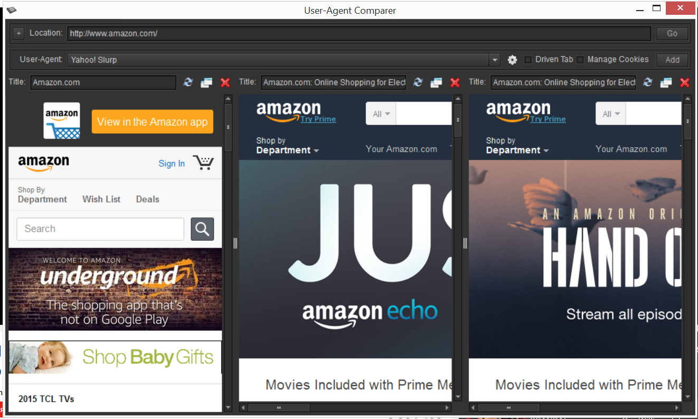

#User-Agent Comparer
  
This is an open-source application based on  Adobe AIR runtime. It requests entered URL with specified User-Agent HTTP header and displays requested web page with its internal WebKit browser. So if web-site has browser specific handling you can find difference  using this application.  
  
Main window of the application  
  
You can create more tabs in main window for each User-Agent you want to see  
  
Move tabs into separate windows for better content view  
  
Settings window allows to add more User-Agent values  
  

[Download User-Agent Comparer installation file](https://github.com/burdiuz/useragent-comparer/raw/master/UserAgentComparer.air)  
> **Note:** This is cross-platform application that can be installed on Windows, Mac or Linux machine. You will need [Adobe AIR runtime](https://get.adobe.com/air/) installed before installing User-Agent Comparer application. [Download Adobe AIR runtime](https://get.adobe.com/air/)  
  
####Resources used in this application  
[Adobe Flex SDK 4](http://www.adobe.com/devnet/flex/flex-sdk-download.html)  
[Kingnare style](http://code.google.com/p/kingnarestyle/) -- application skin  
Icons from:  
http://www.iconfinder.com/  

> Written with [StackEdit](https://stackedit.io/).